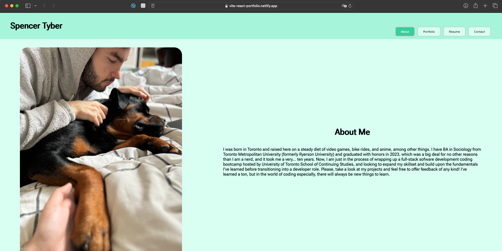

# React Portfolio 

## Description

A portfolio of my software development work in the form of a single-page app built with Vite and React and deployed to Netlify intended to demonstrate skills regarding those languages and platforms and their usage. 

## Usage 

Left-click the following link to visit [Vite + React Portfolio](https://vite-react-portfolio.netlify.app) hosted on Netlify, or right click to copy the URL and paste it into your browser. Click the tabs to view the different information. The Contact page is not functional, as per the acceptance criteria for this project.

## Technologies

### Netlify
### React
### Vite
### Node.js
### JavaScript
### HTML
### CSS

## Credits & Sources

Information and documentation used in the creation of this app, but external to the EdX UofT Full-Stack Software Development Bootcamp including syntaxes, best practises and instructional examples for usage came from the following sources:

- https://developer.mozilla.org/en-US/docs/Web/HTML/Attributes/rel/noopener
- https://stackoverflow.com/questions/63340826/formik-handleblur-use-case
- https://docs.netlify.com/site-deploys/create-deploys/
- https://react.dev/learn/passing-props-to-a-component
- https://www.w3schools.com/tags/att_a_target.asp
- https://react.dev/reference/react/useState
- https://formik.org/docs/api/formik
- https://vitejs.dev/guide/
- https://react.dev/learn

## License

See LICENSE file in repository